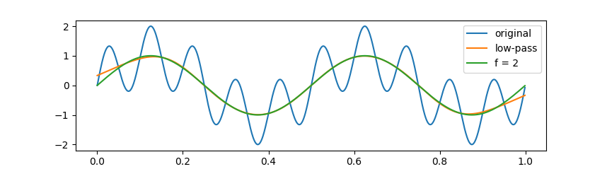
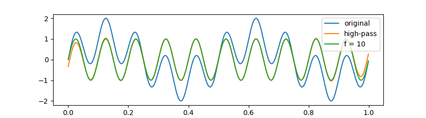
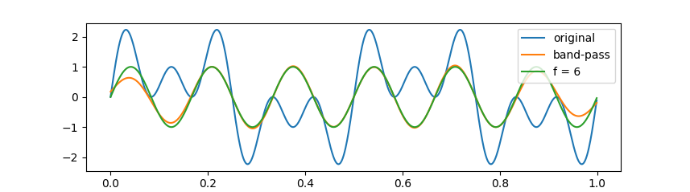
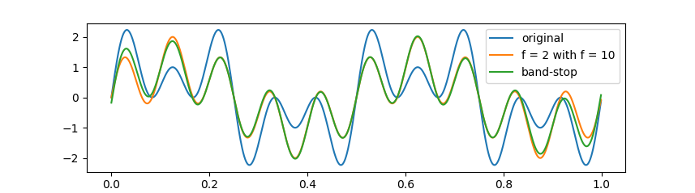
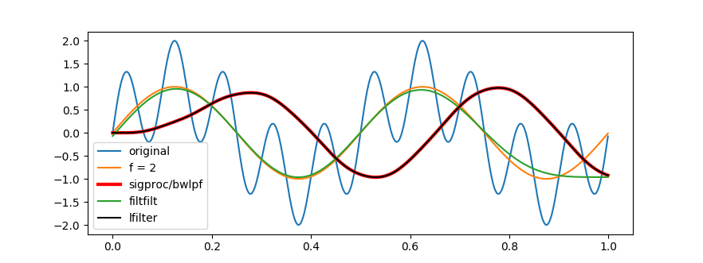
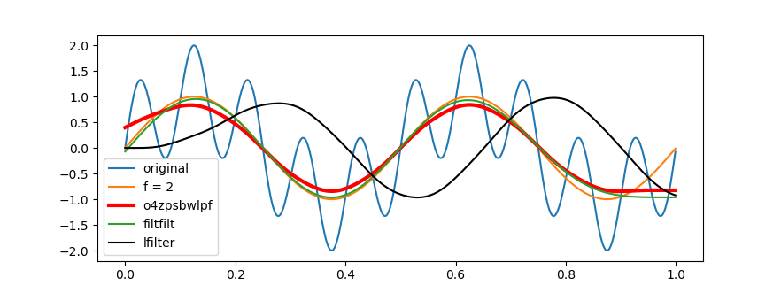
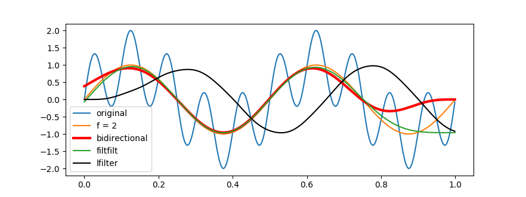

# Road2Filter

**滤波器设计之路**（The road to filter-design），本仓库旨在记录笔者学习和探索的过程，为广大非数字信号处理爱好者提供非专业的、挂一漏万的、顾此失彼的技术入门指导。

### 缘起

随着时代的发展，现有技术总是应付不了需求的变迁，学习就成了一座独木桥，只有硬着头皮一脸眼黑地往前挪，才能不辜负《人与自然》对我们耳濡目染式的竞争教育，并最终在新技术的作用下实现自己也就那么回事儿的抱负。新的技术提出新的需求，新的需求需要新的技术。那时，我在数字信号旁边捣鼓我的新方法，一不小心就碰到了滤波的边儿，为了给滤波一个交代，我开始了磕磕绊绊的滤波器设计学习之路。

信息时代的学习之路很自然地起始于互联网。然，陷于相关知识的匮乏，粗见浅识、张冠李戴，鉴于参差不齐的网文，只言片语、虎头蛇尾，也就造就了这篇参差不齐的技术指导，还请各位看客挑挑捡捡，随便看看。

### 写在不太前面

本文中包含有些许 Mathjax 公式，由于 Github 官方不支持此类公式渲染，公式显示略显凌乱，幸于 Github 网友用爱发电，针对 Chrome 和 Firefox 浏览器，分别安装 [MathJax Plugin for Github](https://chrome.google.com/webstore/detail/mathjax-plugin-for-github/ioemnmodlmafdkllaclgeombjnmnbima)（[Github 仓库](https://github.com/orsharir/github-mathjax)） 和 [github-mathjax-firefox](https://github.com/traversaro/github-mathjax-firefox/releases/download/v0.2.3/github_with_mathjax-0.2.3.xpi)（[Github 仓库](https://github.com/traversaro/github-mathjax-firefox)）插件即可查看完美显示的公式了。

---

### 了不起的滤波器

之所以了不起，是因为信号处理涉及的领域太广了，而滤波几乎又是信号处理的第一需求。滤波器主要有模拟滤波器和数字滤波器之分，前者用于电子电路设计，后者用于数字信号处理。数字滤波器又可以分为 FIR（Finite impulse response，有限脉冲响应）滤波器和 IIR（Infinite impulse response，无限脉冲响应）滤波器。

根据 [Wikipedia](https://en.wikipedia.org/wiki/Filter_design)，**FIR 滤波器**将输出表示为输入的 N 个采样点的加权和（N 为滤波器的阶数）。FIR 滤波器通常是非递归的，不采用反馈机制，本质上是稳定的。而滑动平均滤波是一种递归的采用反馈机制的 FIR 滤波器。如果 FIR 滤波器的系数是对称的，它就具有线性相位，对所有的频率具有相同的延迟。与巧妙设计的 IIR 滤波器相比，_FIR 滤波器更易于设计，但同时也需要更多的计算步骤和内存资源_。**IIR 滤波器**更类似于一个模拟滤波器，它采用当前输入、先前输入和先前输出的线性组合来确定当前输出（即采用反馈机制），理论上这种滤波器的脉冲响应是无限的（即 IIR）。但也由于反馈，高阶 IIR 滤波器不太稳定，存在算术溢出等问题。_由于相移与频率的非线性关系，本质上 IIR 滤波器的时间延迟是频率相关的_，这在许多情况下是不能接受的。

根据 [Wikipedia](https://en.wikipedia.org/wiki/Recursive_filter)，递归型滤波器即使用先前输出作为输入的一种滤波器，这种反馈机制容易但不一定（如滑动平均滤波器）产生一个无限脉冲响应（即 IIR）。非递归型滤波器如：$y[n] = 0.5 x[n - 1] + 0.5 x[n]$；递归型滤波器如：$y[n] = 0.5 y[n - 1] + 0.5 x[n]$。

### 如此简单的 FIR

关于 FIR 滤波器的认识，大都来自于 [Tom Roelandts 的个人博客](https://tomroelandts.com)网站，在[这里](https://tchel.github.io/2019/06/24/Create-a-Filter/)我对他的博文作了总结翻译，并在文末展示了一个应用示例。从学习的角度来讲，顺着我的博文（按照从[低通](https://tomroelandts.com/articles/how-to-create-a-simple-low-pass-filter)、[高通](https://tomroelandts.com/articles/how-to-create-a-simple-high-pass-filter)到[带通带阻](https://tomroelandts.com/articles/how-to-create-simple-band-pass-and-band-reject-filters)的顺序）即可了解 FIR 滤波器的原理，并学会简单的 FIR 滤波器设计。

FIR 滤波器采用褶积运算，对信号的频谱加窗，以实现滤波的目的。据此，可以采用 [sinc 函数](https://tomroelandts.com/articles/how-to-create-a-simple-low-pass-filter)设计出一个简单的低通滤波器。通过[频谱反转](https://tomroelandts.com/articles/how-to-create-a-simple-high-pass-filter)，将低通滤波器转化为一个高通滤波器。低通和高通滤波器的[组合构造](https://tomroelandts.com/articles/how-to-create-simple-band-pass-and-band-reject-filters)，就构造出了带通和带阻滤波器。

### 如此神奇的 IIR

#### 从传输函数到差分方程

根据 [Wikipedia](https://en.wikipedia.org/wiki/Digital_filter)，在离散时间系统中，数字滤波器通常通过经由 Z 变换将传递函数转换为线性常系数差分方程（LCCD）来实现。离散频域传递函数通常写为两个多项式的比，例如：

$$H(z) = \frac{(z + 1)^2}{\big(z - \frac{1}{2}\big)\big(z + \frac{3}{4}\big)} = \frac{z^2 + 2z + 1}{z^2+ \frac{1}{4}z - \frac{3}{8}}$$

为了使对应的滤波器满足因果律，上式中的分子和分母都要除以 z 的最高次幂：

$$H(z) = \frac{1 + 2z^{-1} + z^{-2}}{1 + \frac{1}{4} z^{-1} - \frac{3}{8} z^{-2}} = \frac{Y(z)}{X(z)}$$

线性差分方程的一般形式为：

$$y[n] = - \sum_{k = 1}^M a_k y[n - k] + \sum_{k = 0}^N b_k x[n - k]$$

其中，$a_k$ 为后向反馈（feed-backward）系数，对应于传输函数中的分母系数；$b_k$ 为前向反馈（feed-forward）系数，对应于传输函数中的分子系数。上例中传输函数经变换为：

$$\Big( 1 + \frac{1}{4} z^{-1} - \frac{3}{8} z^{-2} \Big) Y(z) = (1 + 2z^{-1} + z^{-2}) X(z)$$

对上式作反 Z 变换：

$$y[n] + \frac{1}{4} y[n - 1] - \frac{3}{8} y[n - 2] = x[n] + 2x[n - 1] + x[n - 2]$$

也即：

$$y[n] = - \frac{1}{4} y[n - 1] + \frac{3}{8} y[n - 2] + x[n] + 2x[n - 1] + x[n - 2]$$

此式即滤波过程中递归求解的差分方程，$y[n]$ 为当前输出，$y[n - p]$ 为先前输出，$x[n]$ 为当前输入，$x[n - p]$ 则为先前输入。也即 $x$ 为原始信号，$y$ 为滤波信号，$[n]$ 为第 n 个采样点。

#### 传说中的 Butterworth

根据 [Wikipedia](https://en.wikipedia.org/wiki/Butterworth_filter)，以 $\omega_c$ 为截止频率的 Butterworth 低通滤波器的传输函数可以定义为：

$$H(s) = \frac{G_0}{B_n(a)}, a = \frac{s}{\omega_c}$$

其中，$G_0$ 为直流增益（零频响应），一般取 1 即可；$B_n(a)$ 为 Butterworth 多项式。正则化的 Butterworth 多项式（取 $\omega_c = 1$）的一般形式为：

$B_n(s) = \prod_{k = 1}^{\frac{n}{2}} \Big[ s^2 - 2s \cos \Big( \frac{2k + n - 1}{2n} \pi \Big) + 1 \Big]$, for $n$ is even;

$B_n(s) = (s + 1) \prod_{k = 1}^{\frac{n - 1}{2}} \Big[ s^2 - 2s \cos \Big( \frac{2k + n - 1}{2n} \pi \Big) + 1 \Big]$, for $n$ is odd.

由此传输函数即可得到相应的差分方程，进而实现 IIR 滤波器的设计。

---

### 实践里头出真知

#### 令人满意的 FIR

根据[前文](https://tchel.github.io/2019/06/24/Create-a-Filter/)所述的构造方法，在本仓库中，我又重新给出了 FIR 滤波器设计与应用示例的 Python 代码。

在[低通滤波器示例](FIR/lpFIR.py)中，原始波形由频率为 2 Hz 和 10 Hz 的正弦波叠加合成，以 6 Hz 为截止频率进行低通滤波的效果如下图所示：

在[高通滤波器示例](FIR/hpFIR.py)中，原始波形由频率为 2 Hz 和 10 Hz 的正弦波叠加合成，以 6 Hz 为截止频率进行高通滤波的效果如下图所示：

在[带通滤波器示例](FIR/bpFIR.py)中，原始波形由频率为 2 Hz、6 Hz 和 10 Hz 的正弦波叠加合成，分别以 4 Hz 和 6 Hz 为下截止和上截止频率进行带通滤波的效果如下图所示：

在[带阻滤波器示例](FIR/bsFIR.py)中，原始波形由频率为 2 Hz、6 Hz 和 10 Hz 的正弦波叠加合成，分别以 4 Hz 和 6 Hz 为下截止和上截止频率进行带通滤波的效果如下图所示：

在上面的几个例子中，除在信号两端不可避免地出现了滤波信号与实际剩余频率信号有偏差的情况外，内部采样点两种信号几乎完全重叠；整体上，两种信号的相位基本保持一致。

#### 差强我意的 IIR

针对应用较为广泛的 Butterworth 滤波器，根据前文所述的构造方法，即可由传输函数推导得出差分方程，再由差分方程编写出 Butterworth 滤波的程序。考虑到我的实际需求，这里我主要研究了下 Butterworth 低通滤波程序的实现。懒于繁琐的公式推导，我在网络上搜索到了一些 Butterworth 滤波程序。

本仓库 [sigproc 目录](sigproc/)中存有 [Stefan](http://www.exstrom.com/stefan/stefan.html) 和 [Richard](http://www.exstrom.com/richard/richard.html) 编写的数字信号处理程序集（包括 Butterworth 滤波、Chebyshev 滤波等），[此页面](http://www.exstrom.com/journal/sigproc/)有其中各个程序的详细说明。此外，在 [siggen 目录](siggen/)中存有这两位编写的数字信号生成程序集（包括锯齿波、正弦波、随机噪声等），[此页面](http://www.exstrom.com/siggen/index.html)有其中各个程序的详细说明。使用命令 `make -C sigproc/ ; make -C siggen/` 即可完成这两套程序集的编译。

[IIR/o4zpsbwlpf.c](IIR/o4zpsbwlpf.c) 是根据 [Darryl Bryk](https://www.codeproject.com/script/Membership/View.aspx?mid=4882725) 编写的 [C# 滤波程序](https://www.codeproject.com/Tips/1092012/A-Butterworth-Filter-in-Csharp)翻译而来四阶零相移 Butterworth 低通滤波程序。使用命令 `gcc IIR/o4zpsbwlpf.c -lm -o bin/zpsbwlpf` 即可完成程序的编译。

在编译完成后，我们可以通过 [IIR 目录](IIR/)下的 Python 脚本调用这些可执行文件进行滤波。

##### 简单的低通滤波

在 [sigproc 的 Butterworth 低通滤波应用示例](IIR/sigproc_bwlpf.py)中，原始波形由频率为 2 Hz 和 10 Hz 的正弦波叠加合成，_sigproc/bwlpf_ 是以 6 Hz 为截止频率调用 sigproc 中低通滤波程序采用四阶 Butterworth 滤波得到的滤波结果，_filtfilt_ 是调用 python/scipy.signal 模块的双向数字滤波函数 filtfilt 得到的滤波结果，_lfilter_ 是调用该模块的单向滤波函数 lfilter 得到的滤波结果：

从上图中可以看到，简单的 Butterworth（或者 IIR）滤波会导致波形的相位发生移动，而 filtfilt 函数则采用了稍复杂的双向滤波算法得到了零相移的滤波结果。

##### 神奇的零相位滤波

在 [o4zpsbwlpf 四阶零相移 Butterworth 低通滤波示例](IIR/o4zpsbwlpf.py)中，原始波形由频率为 2 Hz 和 10 Hz 的正弦波叠加合成，_o4zpsbwlpf_ 是以 6 Hz 为截止频率调用 o4zpsbwlpf 四阶零相移 Butterworth 低通滤波程序得到的滤波结果：

上图中，与简单的 Butterworth 滤波（lfilter 函数）相比，o4zpsbwlpf 零相移的滤波结果得到大幅改善。

##### 双向滤波的尝试

基于双向滤波的原理，在[双向低通滤波示例](IIR/bidirection.py)中，原始波形由频率为 2 Hz 和 10 Hz 的正弦波叠加合成，_bidirection_ 是以 6 Hz 为截止频率采用 lfilter 函数构造的简单双向滤波处理得到的滤波结果：

可以看到，除尾端外，双向滤波结果的大部分波形相位已得到恢复。若要提高尾端相位的准确度，可能需要像 [o4zpsbwlpf 零相位滤波程序](IIR/o4zpsbwlpf.c)那样，在转向时对波形序列的端点进行特别处理。

